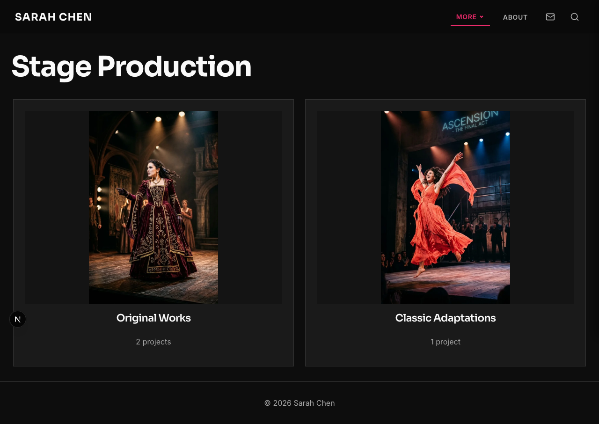
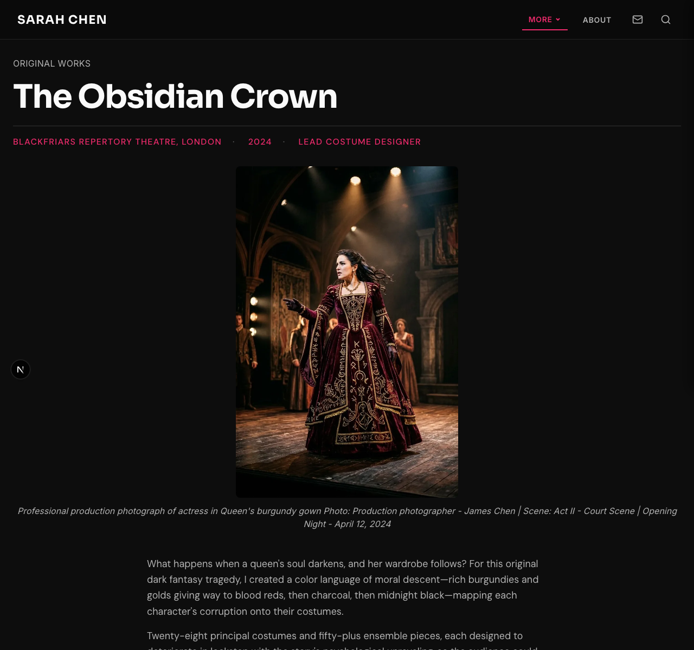
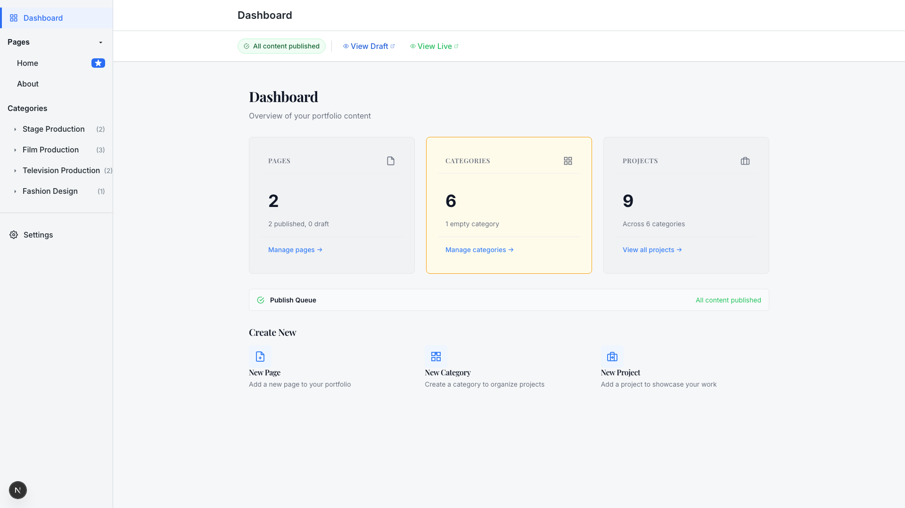
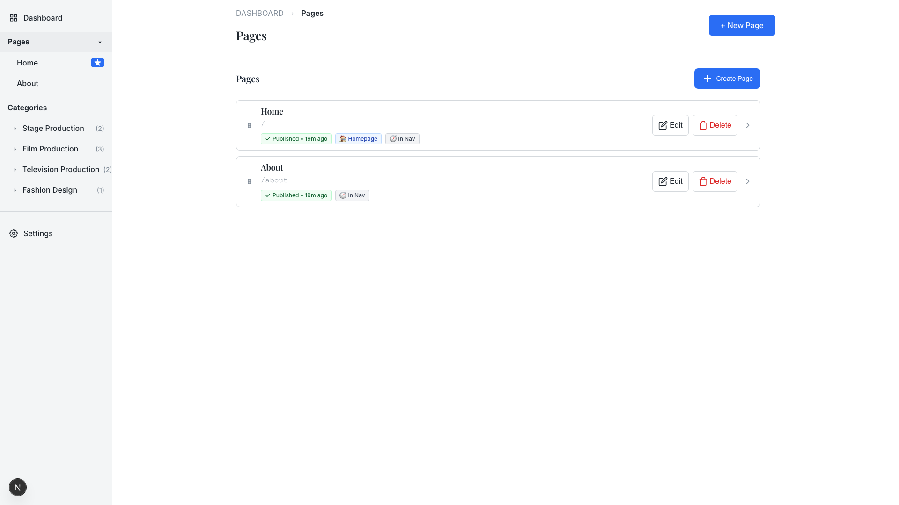
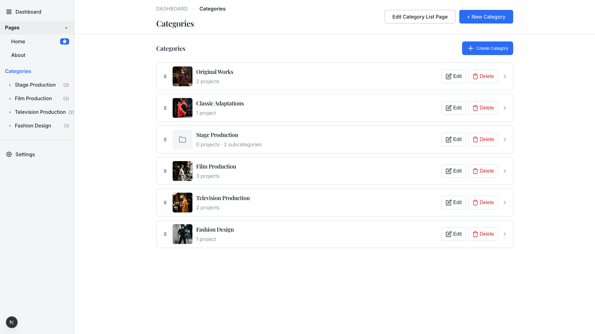
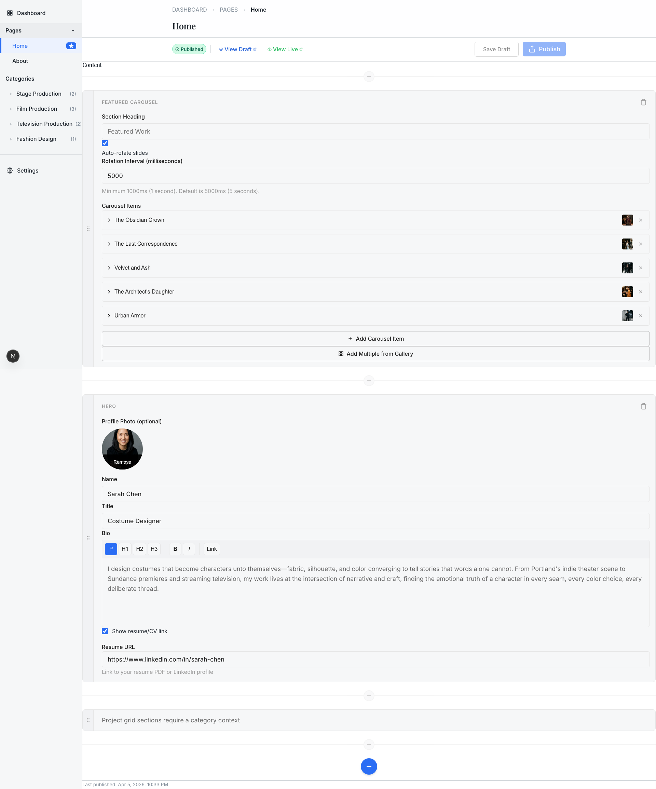

# User Guide

Portfolio Builder gives you a public portfolio site and an admin interface to manage it. Everything you change in the admin flows through to the public site via a draft/publish workflow.

## The Public Site

Your portfolio is what visitors see. It has a homepage, category pages for your work, individual project pages, and an about page.

### Homepage

The homepage opens with a featured image carousel, followed by your profile and a grid of featured work.


### Category Pages

Each category shows its projects in a clean grid. Categories can contain subcategories for organizing related work (e.g. Stage Production → Original Works, Classic Adaptations).



### Project Pages

A project page leads with a hero image, followed by your description and a gallery of all project images. Metadata like production, venue, year, and role appears in the project header automatically.



---

## The Admin Interface

Access the admin at `/admin`. This is where you manage all your portfolio content.

### Dashboard

The dashboard shows your content at a glance: how many pages, categories, and projects you have, plus publish status and quick links.



### Pages

Manage your site's pages (Home, About, and any custom pages). Each page shows its publish status and when it was last updated.



### Categories and Projects

Organize your work into categories. Each category lists its projects and can have subcategories. Drag to reorder.



### Section Editor

Click into any page to edit its content. The section editor lets you build pages from blocks: hero sections, carousels, text, images, and galleries. Each section has its own settings.



---

## How Admin Changes Reach the Public Site

Portfolio Builder uses a **draft/publish workflow**:

1. **Edit** in the admin — changes save as a draft
2. **Preview** your draft with the "View Draft" link
3. **Publish** when you're happy — the public site updates

This means you can work on changes without affecting what visitors see until you're ready.

---

## Content Structure

```
Portfolio
├── Pages
│   ├── Home (carousel + hero + featured work grid)
│   └── About (profile + bio)
├── Categories
│   ├── Stage Production
│   │   ├── Original Works (subcategory)
│   │   └── Classic Adaptations (subcategory)
│   ├── Film Production
│   ├── Television Production
│   └── Fashion Design
└── Projects (belong to categories)
    ├── The Obsidian Crown (in Original Works)
    ├── Velvet and Ash (in Film Production)
    └── ...
```

## Themes

Choose a theme when creating your portfolio. Each theme changes the entire visual feel:

| Theme | Feel |
|-------|------|
| **Modern Minimal** | Clean lines, generous whitespace, understated |
| **Classic Elegant** | Traditional typography, refined details |
| **Bold Editorial** | High contrast, dramatic, magazine-inspired |

---

## Quick Reference

| Want to... | Go to |
|------------|-------|
| Edit homepage content | `/admin` → Pages → Home → Edit |
| Add a new project | `/admin` → Categories → pick a category → New Project |
| Create a category | `/admin` → Categories → New Category |
| Change your bio | `/admin` → Pages → About → Edit |
| Upload project images | `/admin` → edit a project → Gallery section |
| Preview before publishing | Click "View Draft" on any page |
| Publish changes | Click "Publish" in the page editor |